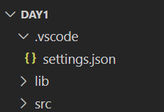

## Getting Started

This project holds the examples and notes from Week 2 Day 1.

Please add the following settings to your .vscode settings.json to prevent distracting suggestiongs while coding.

```,
    "java.debug.settings.onBuildFailureProceed": true,
    "editor.quickSuggestions": {
        "other": false,
        "comments": false,
        "strings": false
    },
    "editor.hover.enabled": false,
```



## Folder Structure

The workspace contains two folders by default, where:

- `src`: the folder to maintain sources
- `lib`: the folder to maintain dependencies

I have added the folder for images

- `imgs`: the folder to store 

Meanwhile, the compiled output files will be generated in the `bin` folder by default.

> If you want to customize the folder structure, open `.vscode/settings.json` and update the related settings there.

## Dependency Management

The `JAVA PROJECTS` view allows you to manage your dependencies. More details can be found [here](https://github.com/microsoft/vscode-java-dependency#manage-dependencies).
